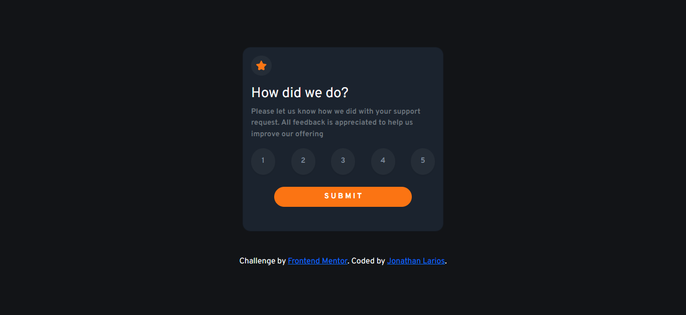
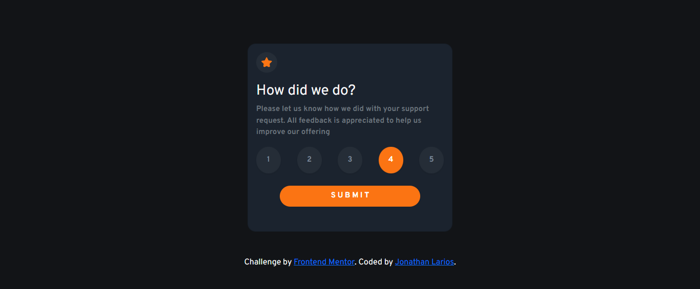
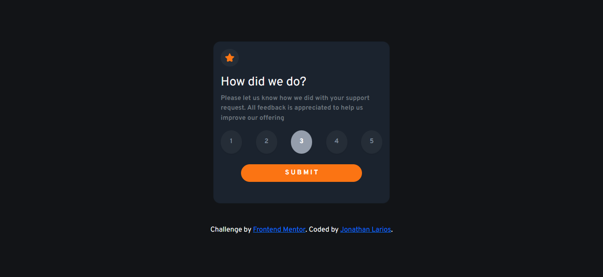
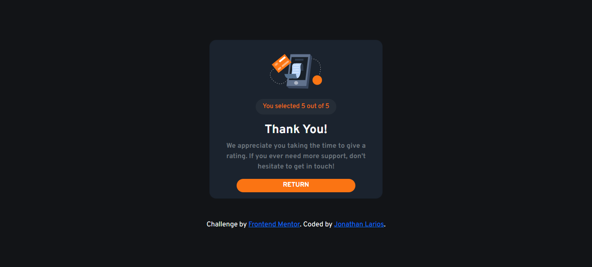

# Frontend Mentor - Interactive rating component solution

This is a solution to the [Interactive rating component challenge on Frontend Mentor](https://www.frontendmentor.io/challenges/interactive-rating-component-koxpeBUmI). Frontend Mentor challenges help you improve your coding skills by building realistic projects.

## Table of contents

- [Overview](#overview)
  - [The challenge](#the-challenge)
  - [Screenshot](#screenshot)
  - [Links](#links)
- [My process](#my-process)
  - [Built with](#built-with)
  - [What I learned](#what-i-learned)
  - [Continued development](#continued-development)
- [Author](#author)

## Overview

### The challenge

Users should be able to:

- View the optimal layout for the app depending on their device's screen size
- See hover states for all interactive elements on the page
- Select and submit a number rating
- See the "Thank you" card state after submitting a rating

### Screenshot






### Links

- Solution URL: [Add solution URL here](https://github.com/JonathanEKP/rating-component)
- Live Site URL: [Add live site URL here](https://jonathanekp.github.io/rating-component/)

## My process

### Built with

- Semantic HTML5 markup
- CSS custom properties
- Mobile-first workflow
- [React](https://reactjs.org/) - JS library
- [Bootstrap](https://getbootstrap.com/) - Design Framework
- [React Router Dom](https://reactrouter.com/en/main) - React Package

### What I learned

I learned how to set an active state by clicking some buttons.

```js
const buttons = document.querySelectorAll(".btn-rate");
buttons.forEach((btn) => {
  if (btn.classList.contains("btn-rate-active")) {
    btn.classList.remove("btn-rate-active");
  }
  if (btn.value == rate) {
    btn.classList.add("btn-rate-active");
  }
});
```

I want to emphasize about using React Context to manage global states

```js
import React, { createContext, useState } from "react";

export const RateContext = createContext();

export function RateContextProvider(props) {
  const [rate, setRate] = useState();

  const obtenerRate = (rate) => {
    setRate(rate);
    const buttons = document.querySelectorAll(".btn-rate");
    buttons.forEach((btn) => {
      if (btn.classList.contains("btn-rate-active")) {
        btn.classList.remove("btn-rate-active");
      }
      if (btn.value == rate) {
        btn.classList.add("btn-rate-active");
      }
    });
  };

  return (
    <RateContext.Provider value={{ rate, obtenerRate }}>
      {props.children}
    </RateContext.Provider>
  );
}
```

### Continued development

I would like to improve responsive web using media querys like this:

```css
@media screen and (max-width: 425px) {
  .card {
    width: 20rem;
  }
}
```


## Author

- Website - [Jonathan Larios](https://jonathanekp.github.io/Portafolio/)
- Frontend Mentor - [@JonathanEKP](https://www.frontendmentor.io/profile/JonathanEKP)


